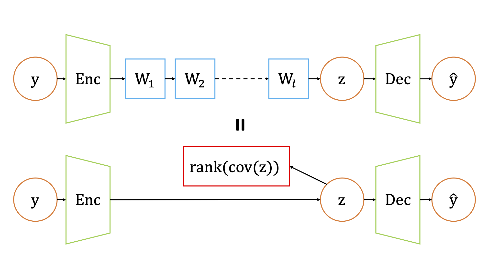
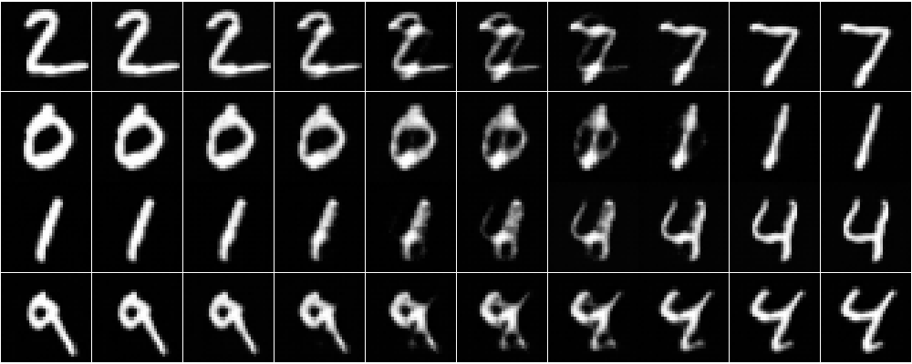
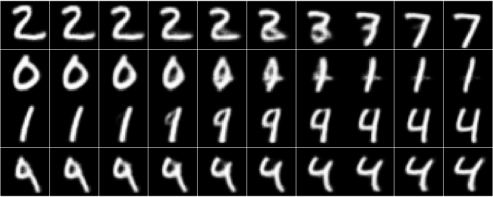
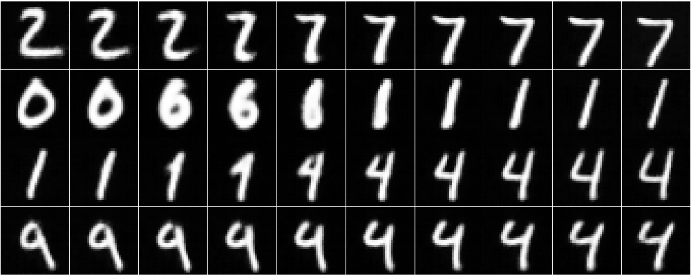
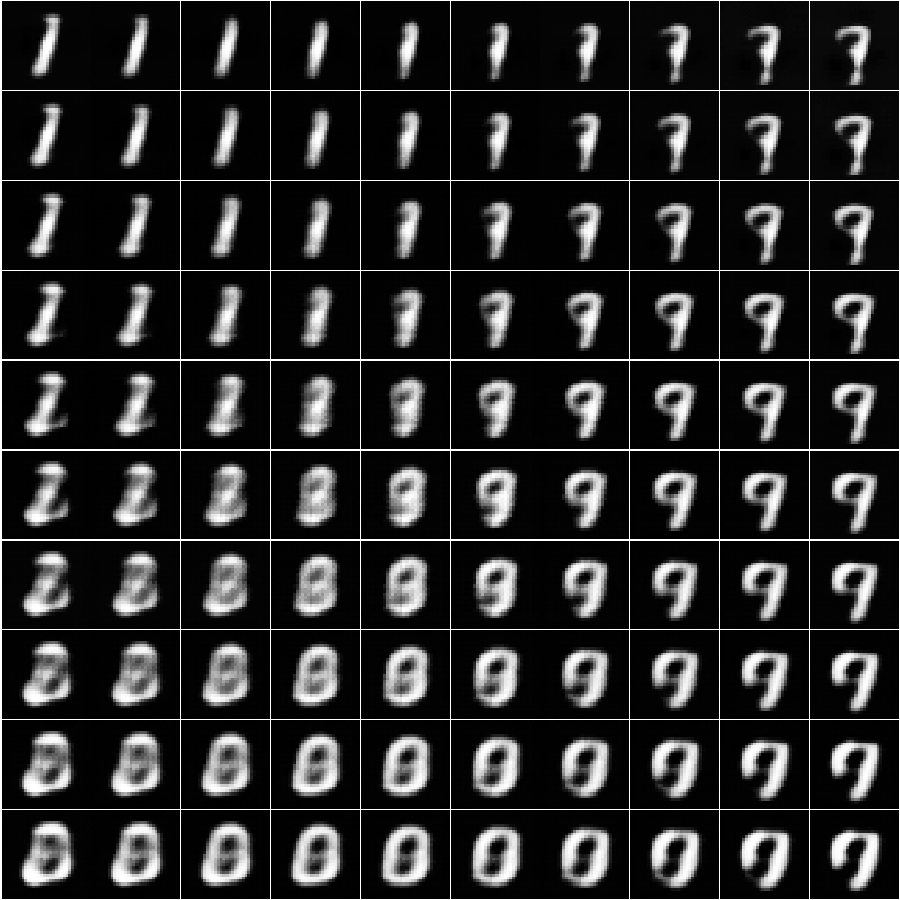
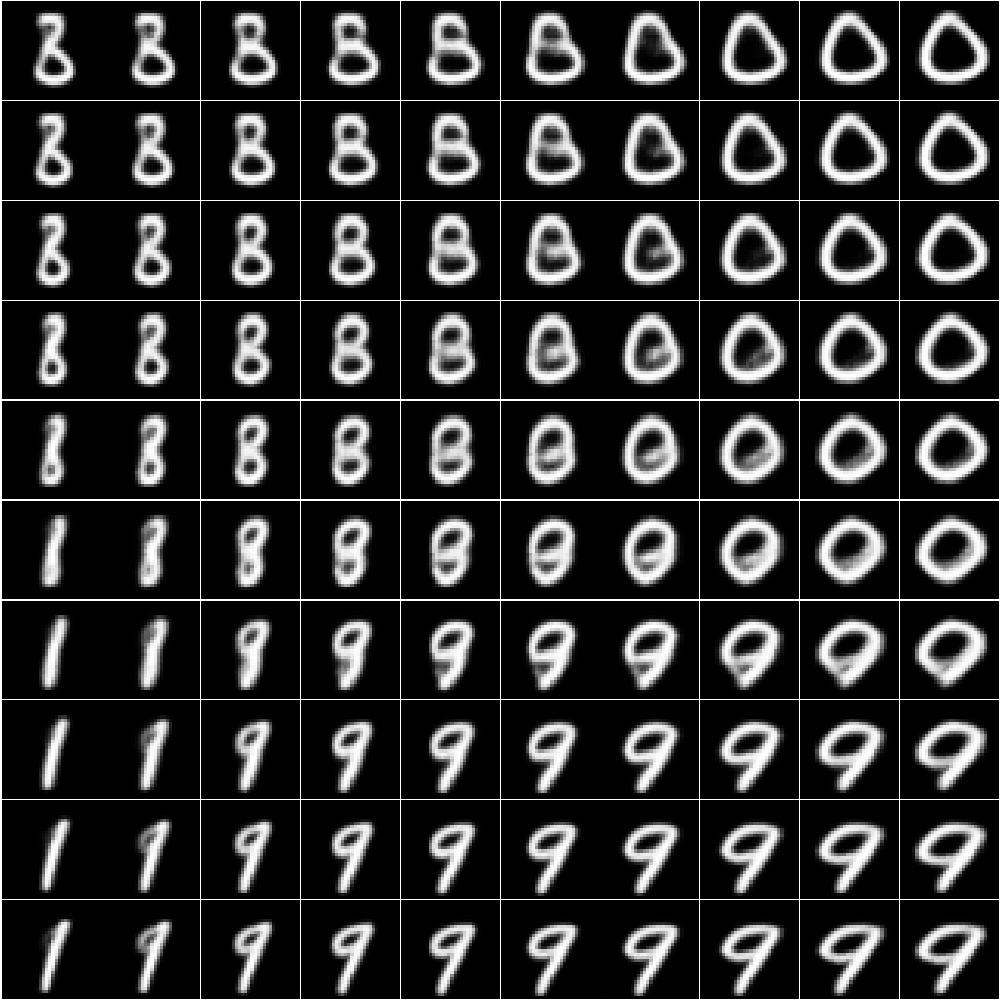
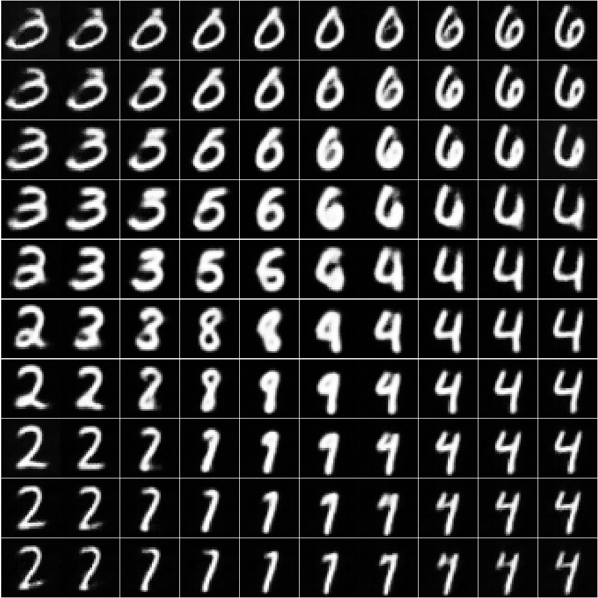

# Implicit Rank-Minimizing Autoencoder

This repository is the official implementation of [Implicit Rank-Minimizing Autoencoder (IRMAE)](https://arxiv.org/abs/2010.00679)

<div>
  
</div>


## Requirements
To install requirements:

```setup
pip install -r requirements.txt
```

## Training
To train the model and baselines in the paper, run this command:

```
python train.py --gpu \
-l <num_matrices> \
--dataset <dataset> \
--model-name <model_name> 
```
Dataset can be `mnist`, `shape`, `celeba`. 

Use `--vae` for VAE mode, `-l 0` for standard AE. 

Use `--data_path <path to dataset>` to specify the path for your CelebA dataset.

Example:
```
python train.py --gpu --dataset mnist -l 0 --model-name ae
python train.py --gpu --dataset mnist -l 8 --model-name irmae
python train.py --gpu --dataset mnist --vae --model-name vae
```


## Evaluation

#### Generative Tasks

```
python generation.py --dataset <dataset> -l <num_matrices> --model-name <model_name> 
```
Model name can be `ae` or `vae` or `irmae`.

Task can be `reconstruction`, `interpolation`, `mvg`, `gmm`, `pca`.


Example:
```
python generation.py --task interpolation --dataset mnist -l 0 --model-name ae
python generation.py --task interpolation --dataset mnist -l 8 --model-name irmae
python generation.py --task interpolation --dataset mnist --vae --model-name vae
```

#### Visualizing Singular Values
```
python singular.py \
--dataset <dataset_name> \
-n <latent_dimension> \
-l <num_matrices> \
--model-name <model_name> 
```

Example:
```
python singular.py --dataset mnist -n 128 -l 8 --model-name irmae
python singular.py --dataset mnist -n 128 -l 0 --model-name ae
python singular.py --dataset mnist -n 128 --vae --model-name vae
```
#### Downstream Classification
```
python classification.py --train-size <num_examples> --model-name <model_name>
```
Use `--vae` for VAE mode. Use `--supervised` for supervised version.

## Results

Interpolation and PCA results of AE, VAE, IRMAE results on MNIST.
<div>
  
  
  
</div>
<div>
  
  
  
</div>


## License
See the [LICENSE](LICENSE) file for more details.

## Citation
If you find this repository useful in your research, please cite:
```
@article{jing2020implicit,
  title={Implicit Rank-Minimizing Autoencoder},
  author={Jing, Li and Zbontar, Jure and LeCun, Yann},
  journal={arXiv preprint arXiv:2010.00679},
  year={2020}
}
```
